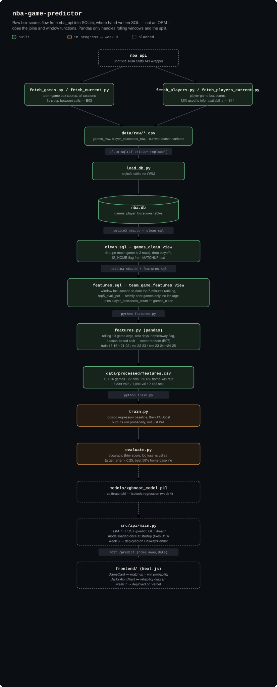

# NBA Game Predictor

A game-level NBA win probability predictor. Given two teams playing tonight, the model outputs a calibrated win probability for each team, served through an API and shown on a dashboard.

This is a portfolio/learning project with two goals alongside the model itself: (1) practice leakage-safe ML — season-based splits, calibration, interpretability — and (2) practice raw SQL (`sqlite3`, no ORM) as the storage/query layer.

**Not a betting tool.** The model isn't expected to beat Vegas lines, and that comparison is documented honestly rather than hidden. **Not real-time** — data is refreshed by running a script, not on a schedule.

## Status

- ✅ Week 1 — SQL storage layer (SQLite, raw SQL, no ORM)
- ✅ Week 2 — Feature engineering, including player-availability signal. `features.csv`: 10,616 games, 22 columns, split 7,339 train / 1,094 val / 2,183 test.
- ⏳ Week 3 — Baseline model (`train.py`, `evaluate.py`) — next up
- ⬜ Weeks 4–8 — Calibration, SHAP interpretability, FastAPI serving, Next.js dashboard, polish

Full roadmap, decisions, and known bugs live in [`PLAN.md`](./PLAN.md).

## Architecture

Raw box scores are pulled from `nba_api`, loaded into SQLite as-is, and then cleaned/aggregated with hand-written SQL — joins and window functions happen in the database, not in pandas. Pandas takes over only for the parts SQL is bad at (rolling windows across time, train/val/test splitting). The trained model will be served through a thin FastAPI layer and displayed on a Next.js dashboard.



The project's actual argument sits in the middle third: `clean.sql` and `features.sql` do the dedup, join, and leakage-safe window-function work in the database, and `features.py` only picks up what SQL can't do well — rolling time windows and the train/val/test split. Everything below `features.csv` (amber/dashed in the diagram) is Week 3 onward, not yet built.

## Tech stack

| Layer | Tool | Why |
|---|---|---|
| Data fetching | `nba_api` | Unofficial but well-maintained wrapper for NBA Stats API |
| Storage & query | `sqlite3` (stdlib, no ORM) | Real SQL practice — joins/aggregation live in SQL, not pandas |
| Data processing | `pandas` | Feature engineering on top of SQL query results |
| Modeling | `xgboost` | Fast, interpretable, standard for tabular data |
| Calibration | `scikit-learn` (isotonic regression) | Corrects XGBoost's overconfident probabilities |
| Interpretability | `shap` | Explains which features drive each prediction |
| API | `FastAPI` | Lightweight, async, auto-docs at `/docs` |
| Frontend | `Next.js` + `Tailwind` | Dashboard for win probabilities |
| Deployment | Railway / Render + Vercel | Free tier sufficient for this project |

## Data pipeline in one sentence

Each raw game row appears twice (once per team) with playoff and regular-season rows mixed together; `clean.sql` dedupes to one row per game and flags home/away, then `features.sql` computes leakage-safe rolling averages and a "were this team's top-5 rotation players available" signal using only data strictly before each game, before pandas does the final rolling-window and season-based split work.

## Running it locally

```bash
# 1. Environment
python -m venv .venv
source .venv/bin/activate
pip install -r requirements.txt

# 2. Fetch data
python src/data/fetch_games.py
python src/data/fetch_players.py
python src/data/fetch_current.py

# 3. Load + clean
python src/data/load_db.py
sqlite3 data/db/nba.db < src/data/clean.sql

# 4. Engineer features
sqlite3 data/db/nba.db < src/data/features.sql
python src/data/features.py

# 5. Train / evaluate (Week 3+)
python src/model/train.py
python src/model/evaluate.py

# 6. Serve (Week 6+)
uvicorn src.api.main:app --reload
cd frontend && npm run dev
```

## Known limitations

- Player availability is inferred from minutes played (0/NULL = did not play), not an official injury report — see `PLAN.md` bug B05/B14.
- Data refresh and model retraining are manual, by design — no schedulers or cron jobs.
- Predicts single-game win probability only, not series or championship outcomes.

See [`PLAN.md`](./PLAN.md) for the full bug list, feature backlog, and evaluation criteria.
